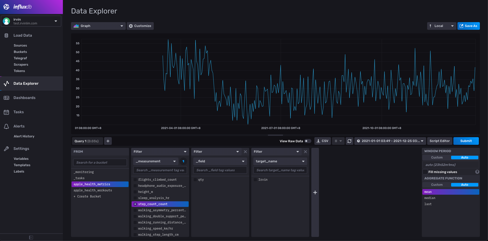

# Apple Health Ingester


[](https://app.codecov.io/gh/irvinlim/apple-health-ingester)
[](https://hub.docker.com/r/irvinlim/apple-health-ingester)
[](https://hub.docker.com/r/irvinlim/apple-health-ingester/tags)

Simple HTTP server written in Go that ingests data from [Health Auto Export](https://www.healthexportapp.com/) into multiple configurable storage backends.

## Why?

The *Health Auto Export* app (https://www.healthexportapp.com) allows you to easily export Apple Health data from your iOS device into a portable format. However, it currently only supports the following export methods:

- iCloud Drive
- [REST API](https://www.healthyapps.dev/how-to-configure-automatic-apple-health-exports#restapi)
- [Home Assistant](https://www.healthyapps.dev/how-to-configure-automatic-apple-health-exports#homeassistant)
- [MQTT](https://www.healthyapps.dev/how-to-configure-automatic-apple-health-exports#mqtt)

As such, this simple HTTP server will receive requests from the *Health Auto Export* app via the *REST API* export method, which allows the flexibility to export data into one or more configured backends.

## Setup Instructions

You will first have to download the [*Health Auto Export*](https://www.healthexportapp.com) iOS app on your iOS device. **NOTE**: You will need to purchase Premium, or use the free trial to enable Automations.

In the app, create a new Automation (detailed instructions [here](https://www.healthyapps.dev/how-to-configure-automatic-apple-health-exports)):
   
1. Under *Automation Type*, select `REST API`.
2. Enter the URL to your server (see below for instructions on how to run the server).
   - The URL should look like `http://your.domain/api/healthautoexport/v1/influxdb/ingest`
   - Optional: To identify the source of data (i.e. the person's whose health is being tracked), add `?target=NAME` to the end of the URL, where `NAME` is a friendly name such as `John`. This will enable target name tracking in the ingester.
3. Under *Export format*, select `JSON`.
4. You can optionally choose which Health Metrics and/or Workouts to send.
5. Under *Manual Sync*, you can select a time range, and click "Export" to test if it is working.

## Running the Server

### Running Locally

You only need `go` to build the server.

```sh
$ go build -o build/ingester ./cmd/ingester/....
$ ./build/ingester --help
Usage of ./build/ingester:
      --backend.influxdb                     Enable the InfluxDB storage backend.
      --backend.localfile                    Enable the LocalFile storage backend.
      --http.authToken string                Optional authorization token that will be used to authenticate incoming requests.
      --http.listenAddr string               Address to listen on. (default ":8080")
      --influxdb.authToken string            Auth token to connect to InfluxDB.
      --influxdb.metricsBucketName string    InfluxDB bucket name for metrics.
      --influxdb.orgName string              InfluxDB organization name.
      --influxdb.serverURL string            Server URL for InfluxDB.
      --influxdb.staticTags strings          Additional tags to add to InfluxDB for every single request, in key=value format.
      --influxdb.workoutsBucketName string   InfluxDB bucket name for workouts.
      --localfile.metricsPath string         Output path to write metrics, with one metric per file. All data will be aggregated by timestamp. Any existing data will be merged together.
```

### Docker

```sh
$ docker pull irvinlim/apple-health-ingester
```

## Global Configuration

- `http.listenAddr`: Address to listen on. (default ":8080")
- `http.authToken`: Optional authorization token that will be used to authenticate incoming requests.

## Supported Backends

### LocalFile

- URL: `/api/healthautoexport/v1/localfile/ingest`

Writes the ingested payloads into the local filesystem as JSON. Mainly intended to be used for debugging purposes, but the logic could be easily extended for file backups on a remote file store (e.g. S3, Dropbox, etc).

#### Configuration

This backend is disabled by default.  You can enable it by specifying `--backend.localfile`.

You must also configure additional fields for the backend to work. Example configuration:

```sh
$ ingester \
  --backend.localfile \
  --localfile.metricsPath=/data/health-export-metrics
```

**NOTE**: Workout data is currently not yet supported for this storage backend.

#### Example Output

This will produce a directory with each metric stored as a separate file as follows:

```sh
$ ls -la /data/health-export-metrics
total 2604
drwxr-xr-x 96 irvin   3072 Dec 25 00:15  .
drwxr-xr-x  3 irvin     96 Dec 25 00:11  ..
-rw-r--r--  1 irvin 418389 Dec 25 00:19  active_energy_kJ.json
-rw-r--r--  1 irvin  30279 Dec 25 00:19  apple_exercise_time_min.json
-rw-r--r--  1 irvin   4755 Dec 25 00:19  apple_stand_hour_count.json
-rw-r--r--  1 irvin 124346 Dec 25 00:19  apple_stand_time_min.json
-rw-r--r--  1 irvin     72 Dec 25 00:19  basal_body_temperature_degC.json
-rw-r--r--  1 irvin 851170 Dec 25 00:19  basal_energy_burned_kJ.json
...
```

If target name is specified during export, then the filename will be prefixed with the target name.

### InfluxDB

- URL: `/api/healthautoexport/v1/influxdb/ingest`

Writes the ingested metrics and workout data into a configured InfluxDB backend.

#### Configuration

This backend is disabled by default. You can enable it by specifying `--backend.influxdb`.

You must also configure additional fields for the backend to work. Example configuration:

```sh
$ ingester \
  --backend.influxdb \
  --influxdb.serverURL=http://localhost:8086 \
  --influxdb.authToken=INFLUX_API_TOKEN \
  --influxdb.orgName=my-org \
  --influxdb.metricsBucketName=apple_health_metrics \
  --influxdb.workoutsBucketName=apple_health_workouts
```

#### Metrics Data Format

All metrics will be stored in the bucket named by `--influxdb.metricsBucketName` using the following format:

- Measurement: 
  - Metric name (e.g. `active_energy`) + Unit (e.g. `kJ`)
  - Example: `active_energy_kJ`
- Fields:
  - Most metrics will use `qty` for field name.
  - Some metrics which have multiple fields will use their corresponding field name. For example, `sleep_analysis_hr` uses the following field names:
    - `inBed`
    - `inBedStart`
    - `inBedEnd`
    - `inBedSource`
    - The rest of the fields can be found here: https://github.com/Lybron/health-auto-export/wiki/API-Export---JSON-Format
- Tags:
  - `target_name`: Optional, set by `?target=TARGET_NAME` query string from HTTP request.
  - Additional tags can be set by `--influxdb.staticTags`.

#### Workouts Data Format

Workout data will be stored in the bucket named by `--influxdb.workoutsBucketName`. Workout data is slightly more complicated than metrics. You can read more about the workout data format here: https://github.com/Lybron/health-auto-export/wiki/API-Export---JSON-Format#workouts 

There are two kinds of data:

1. **Workout summary data**: Contains aggregate statistics about each workout (i.e. one point per workout)
   - Measurement: `workout`
   - Fields:
     - Example: `activeEnergy_kJ`
   - Timestamp: Uses the workout's start time
2. **During-workout time-series data**: Contains per-minute granularity time-series data
   - Measurement: Currently, only the following measurements are supported for this type of data: 
     - `heart_rate_data_bpm`
       - Fields: `qty`
     - `heart_rate_recovery_bpm`
       - Fields: `qty`
     - `route`
       - Fields: `lat`, `lon`, `altitude`
   - Timestamp: Corresponds to the `date`/`timestamp` field

All workout data have the following tags:

- Tags:
  - `target_name`: Optional, set by `?target=TARGET_NAME` query string from HTTP request.
  - `workout_name`: Name of the workout. 
    - Example `Walking`
  - Additional tags can be set by `--influxdb.staticTags`.

#### Example Output



## License

MIT
