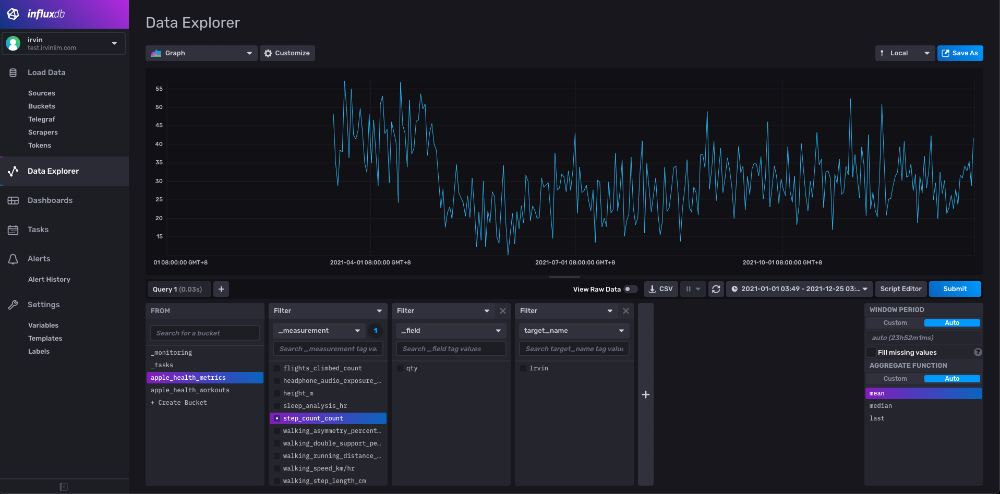

# Apple Health Ingester


[](https://app.codecov.io/gh/irvinlim/apple-health-ingester)
[](https://hub.docker.com/r/irvinlim/apple-health-ingester)
[](https://hub.docker.com/r/irvinlim/apple-health-ingester/tags)

Simple HTTP server written in Go that ingests data from [Health Auto Export](https://www.healthexportapp.com/) into multiple configurable storage backends.

## Why?

The *Health Auto Export* app (https://www.healthexportapp.com) allows you to easily export Apple Health data from your iOS device into a portable format, and currently supports exporting to various sinks such as [Google Drive](https://www.healthyapps.dev/how-to-configure-automatic-apple-health-exports#googledrive), [Dropbox](https://www.healthyapps.dev/how-to-configure-automatic-apple-health-exports#dropbox) and [Home Assistant](https://www.healthyapps.dev/how-to-configure-automatic-apple-health-exports#homeassistant).

As such, this simple HTTP server will receive requests from the *Health Auto Export* app via the [REST API export method](https://www.healthyapps.dev/how-to-configure-automatic-apple-health-exports#restapi), which allows the flexibility to export data into one or more configured backends.

## Features

* Supports multiple backends for writing metrics.
  * **Local File**: Writes the ingested payloads into the local filesystem as JSON.
  * **InfluxDB**: Writes the ingested metrics and workout data to InfluxDB (or any other databases that support the protocol such as [VictoriaMetrics](https://github.com/VictoriaMetrics/VictoriaMetrics#how-to-send-data-from-influxdb-compatible-agents-such-as-telegraf)).
* Supports ingestion of data separately from multiple iOS devices.
* Optional Bearer authentication to protect publicly exposed endpoints.

## Setup Instructions

### Health Auto Export Setup

You will first have to download the [*Health Auto Export*](https://www.healthexportapp.com) iOS app on your iOS device. 

> **NOTE**: You will need to purchase [a Premium subscription](https://www.healthyapps.dev/health-auto-export-pricing), or use the free trial in order to enable Automations.

In the app, create a new Automation:
   
1. Under *Automation Type*, select `REST API`.
2. Enter the URL to your server (see below for instructions on how to run the server).
   - The URL should look like `http://your.domain/api/healthautoexport/v1/influxdb/ingest`
   - Optional: To identify the source of data (i.e. the person's whose health is being tracked), add `?target=NAME` to the end of the URL, where `NAME` is a friendly name such as `John`. This will enable target name tracking in the ingester.
3. Under *Export format*, select `JSON`.
4. You can optionally choose which Health Metrics and/or Workouts to send.
5. Under *Manual Sync*, you can select a time range, and click "Export" to test if it is working.

For more detailed instructions, refer to the [official site](https://www.healthyapps.dev/how-to-configure-automatic-apple-health-exports).

### Running the Server

You can deploy and run the server using Docker or as a standalone binary, which is packaged and released on the [GitHub Releases page](https://github.com/irvinlim/apple-health-ingester/releases).

### Linux Download

The following command downloads the server for `linux-amd64`. For more platforms, refer to the [Releases](https://github.com/irvinlim/apple-health-ingester/releases) page.

```sh
$ curl -L https://github.com/irvinlim/apple-health-ingester/releases/latest/download/apple-health-ingester-linux-amd64 > apple-health-ingester
$ chmod +x apple-health-ingester
$ ./apple-health-ingester --help
```

### Docker Image

The image is also hosted on [Docker Hub](https://hub.docker.com/r/irvinlim/apple-health-ingester).

```sh
$ docker run --rm irvinlim/apple-health-ingester --help
```

## Configuration

### Specifying Configuration 

Configuration can be specified in the following places, in order of precedence from lowest to highest:

- Config file (**preferred**)
- Environment variables
- Command-line flags

See the following sections for available configuration keys for each of the available configuration methods. 

#### Configuration File

The preferred method of configuration is via configuration files. An example configuration file to get started is as follows:

```sh
httpServer:
  listenAddr: ":8080"
backends:
  influxdb:
    enabled: true
    serverURL: "<YOUR INFLUXDB URL>"
    orgName: "<YOUR ORG NAME>"
    bucketNames:
      metrics: "apple_health_metrics"
      workouts: "apple_health_workouts"
```

Configuration files can be specified in both JSON and YAML format. To pass the configuration to the application, use the `--config` or `-c` command-line flag such as follows:

```sh
./build/ingester -c config.yaml
```

If any of the following configuration paths exist, the config file will be automatically discovered and loaded, listed below in order of preference:

- `./config.yaml`
- `./config.json`
- `/config.yaml`
- `/config.json`

#### Environment Variables

Environment variables take greater precedence over those specified via configuration files. These can be used to override behaviour at runtime if necessary.

Not all configuration fields will be exposed via environment variables, and therefore it is recommended to only make use of environment variables sparingly.

#### Command-line Flags

Finally, command-line flags take highest precedence over all other configuration methods available. Similar to environment variables, not all configuration can be configured via command-line flags, and therefore it is recommended to define complex configuration in a config file instead.

Since command-line flags were introduced since the beginning, support for existing command-line flags will _not_ be dropped to maintain backwards compatibility.

The following command-line flags are currently available:

```sh
$ ./build/ingester --help
Usage of ./build/ingester:
      --backend.influxdb                     Enable the InfluxDB storage backend.
      --backend.localfile                    Enable the LocalFile storage backend.
  -c, --config string                        Path to YAML or JSON configuration file.
                                             However, config specified via environment variables or command-line arguments will still take greater precedence.
                                             If not specified, attempts to discover configuration files at the following locations in order:
                                               config.yaml, config.json, /config/config.yaml, /config/config.json
      --http.authToken string                Optional authorization token that will be used to authenticate incoming requests.
                                             Environment variable: $AUTH_TOKEN
      --http.certFile string                 Certificate file for TLS support.
                                             Environment variable: $TLS_CERT_FILE
      --http.enableTLS                       Enable TLS/HTTPS. Requires setting certificate and key files.
                                             Environment variable: $TLS_ENABLED
      --http.keyFile string                  Key file for TLS support.
                                             Environment variable: $TLS_KEY_FILE
      --http.listenAddr string               Address to listen on.
                                             Environment variable: $LISTEN_ADDR
      --influxdb.authToken string            Auth token to connect to InfluxDB.
                                             Environment variable: $INFLUXDB_AUTH_TOKEN
      --influxdb.insecureSkipVerify          Skip TLS verification of the certificate chain and host name for the InfluxDB server.
                                             Environment variable: $INFLUXDB_INSECURE_SKIP_VERIFY
      --influxdb.metricsBucketName string    InfluxDB bucket name for metrics.
                                             Environment variable: $INFLUXDB_METRICS_BUCKET
      --influxdb.orgName string              InfluxDB organization name.
                                             Environment variable: $INFLUXDB_ORG_NAME
      --influxdb.serverURL string            Server URL for InfluxDB.
                                             Environment variable: $INFLUXDB_SERVER_URL
      --influxdb.staticTags strings          Additional tags to add to InfluxDB for every single request, in key=value format.
      --influxdb.workoutsBucketName string   InfluxDB bucket name for workouts.
                                             Environment variable: $INFLUXDB_WORKOUTS_BUCKET
      --localfile.metricsPath string         Output path to write metrics, with one metric per file. All data will be aggregated by timestamp. Any existing data will be merged together.
      --log string                           Log level to use. (default "info")
```

### Configuration Fields

#### Log Level

Specify the log level. The following log levels are supported, and in order of verbosity from lowest to highest:

- `panic`
- `fatal`
- `error`
- `warn`/`warning`
- `info` (default)
- `debug`
- `trace`

Increase the level to `debug` for more verbose logging.

- Default: `info`
- Command-line: `--log`

#### Listen Address

Address to listen on, in `IP:port` format.

- Default: `:8080`
- Config file: `httpServer.listenAddr`
- Environment variable: `$LISTEN_ADDR`
- Command-line: `--http.listenAddr`

#### HTTP Authorization Token

Optional authorization token that will be used to authenticate incoming requests. The header name should be `Authorization`, and the header value should be `Bearer <TOKEN>`.

- Config file: `httpServer.auth.authorizationToken`
- Environment variable: `$AUTH_TOKEN`
- Command-line: `--http.authToken`

#### HTTP TLS Configuration

_Enable TLS_

The following configuration fields are available to enable TLS:

- Config file: `httpServer.tls.enabled`
- Environment variable: `$TLS_ENABLED`
- Command-line: `--http.enableTLS`

_Certificate File / Key File_

If TLS is enabled, the TLS certificate needs to be provided that will be served.

- Certificate File
  - Config file: `httpServer.tls.certFile`
  - Environment variable: `$TLS_CERT_FILE`
  - Command-line: `--http.certFile`
- Key File
  - Config file: `httpServer.tls.keyFile`
  - Environment variable: `$TLS_KEY_FILE`
  - Command-line: `--http.keyFile`

_Certificate Data / Key Data_

Alternatively, encode the actual TLS certificate in the configuration file, such as follows:

```yaml
httpServer:
  tls:
    enabled: true
    certData: |
      -----BEGIN CERTIFICATE-----
      data omitted...
      -----END CERTIFICATE-----
```

- Certificate Data
  - Config file: `httpServer.tls.certData`
- Key File
  - Config file: `httpServer.tls.keyData`

## Supported Backends

Each backend must be enabled explicitly. By default, no backends are enabled by default.

Additionally, each backend currently has a fixed URL that must be used when configuring the automation in Health Auto Export.

### LocalFile

- URL: `/api/healthautoexport/v1/localfile/ingest`

Writes the ingested payloads into the local filesystem as JSON. Mainly intended to be used for debugging purposes, but the logic could be easily extended for file backups on a remote file store (e.g. S3, Dropbox, etc).

#### Configuration

This backend is disabled by default.  You can enable it by specifying:

- Config file: `backends.localfile.enabled`
- Command-line: `--backend.localfile`

You must also configure additional fields for the backend to work. Example configuration:

```yaml
backends:
  localfile:
    enabled: true
    metricsPath: /data/health-export-metrics
```

**NOTE**: Workout data is currently not yet supported for this storage backend.

#### Example Output

This will produce a directory with each metric stored as a separate file as follows:

```sh
$ ls -la /data/health-export-metrics
total 2604
drwxr-xr-x 96 irvin   3072 Dec 25 00:15  .
drwxr-xr-x  3 irvin     96 Dec 25 00:11  ..
-rw-r--r--  1 irvin 418389 Dec 25 00:19  active_energy_kJ.json
-rw-r--r--  1 irvin  30279 Dec 25 00:19  apple_exercise_time_min.json
-rw-r--r--  1 irvin   4755 Dec 25 00:19  apple_stand_hour_count.json
-rw-r--r--  1 irvin 124346 Dec 25 00:19  apple_stand_time_min.json
-rw-r--r--  1 irvin     72 Dec 25 00:19  basal_body_temperature_degC.json
-rw-r--r--  1 irvin 851170 Dec 25 00:19  basal_energy_burned_kJ.json
...
```

If target name is specified during export, then the filename will be prefixed with the target name.

### InfluxDB

- URL: `/api/healthautoexport/v1/influxdb/ingest`

Writes the ingested metrics and workout data into a configured InfluxDB backend.

#### Configuration

This backend is disabled by default. You can enable it by specifying:

- Config file: `backends.influxdb.enabled`
- Command-line: `--backend.influxdb`

You must also configure additional fields for the backend to work. Example configuration:

```yaml
backends:
  influxdb:
    # Must be set to true to enable this backend.
    enabled: true
    # The URL to the InfluxDB server.
    # Environment variable: $INFLUXDB_SERVER_URL.
    serverURL: "http://localhost:8086"
    # If true, skips TLS verification of the certificate chain and host name for
    # the InfluxDB server.
    # Environment variable: $INFLUXDB_INSECURE_SKIP_VERIFY
    insecureSkipVerify: false
    # Auth token to connect to InfluxDB.
    # Environment variable: $INFLUXDB_AUTH_TOKEN
    authToken: YOUR_INFLUX_API_TOKEN
    # InfluxDB organization name.
    # Environment variable: $INFLUXDB_ORG_NAME
    orgName: my-org
    # Configuration for InfluxDB bucket names for various data points.
    bucketNames:
      # InfluxDB bucket name for metrics.
      # Environment variable: $INFLUXDB_METRICS_BUCKET
      metrics: apple_health_metrics
      # InfluxDB bucket name for workouts.
      # Environment variable: $INFLUXDB_WORKOUTS_BUCKET
      workouts: apple_health_workouts
    # Additional tags to add to InfluxDB for every single request.
    # Uncomment the following lines to add static tags to all metrics.
    #staticTags:
    #  key1: value1
    #  key2: value2
```

#### Metrics Data Format

All metrics will be stored in the _Metrics Bucket_ using the following format:

- Measurement: 
  - Metric name (e.g. `active_energy`) + Unit (e.g. `kJ`)
  - Example: `active_energy_kJ`
- Fields:
  - Most metrics will use `qty` for field name.
  - Some metrics which have multiple fields will use their corresponding field name. For example, `sleep_analysis_hr` uses the following field names:
    - `inBed`
    - `inBedStart`
    - `inBedEnd`
    - `inBedSource`
    - The rest of the fields can be found here: https://github.com/Lybron/health-auto-export/wiki/API-Export---JSON-Format
- Tags:
  - `target_name`: Optional, set by `?target=TARGET_NAME` query string from HTTP request.
  - Additional tags can be set by `--influxdb.staticTags` / `backends.influxdb.staticTags`.

#### Workouts Data Format

Workout data will be stored in the _Workouts Bucket_. Workout data is slightly more complicated than metrics. You can read more about the workout data format here: https://github.com/Lybron/health-auto-export/wiki/API-Export---JSON-Format#workouts 

There are two kinds of data:

1. **Workout summary data**: Contains aggregate statistics about each workout (i.e. one point per workout)
   - Measurement: `workout`
   - Fields:
     - Example: `activeEnergy_kJ`
   - Timestamp: Uses the workout's start time
2. **During-workout time-series data**: Contains per-minute granularity time-series data
   - Measurement: Currently, only the following measurements are supported for this type of data: 
     - `heart_rate_data_bpm`
       - Fields: `qty`
     - `heart_rate_recovery_bpm`
       - Fields: `qty`
     - `route`
       - Fields: `lat`, `lon`, `altitude`
   - Timestamp: Corresponds to the `date`/`timestamp` field

All workout data have the following tags:

- Tags:
  - `target_name`: Optional, set by `?target=TARGET_NAME` query string from HTTP request.
  - `workout_name`: Name of the workout. 
    - Example `Walking`
  - Additional tags can be set by `--influxdb.staticTags` / `backends.influxdb.staticTags`.

#### Example Output



## License

MIT
